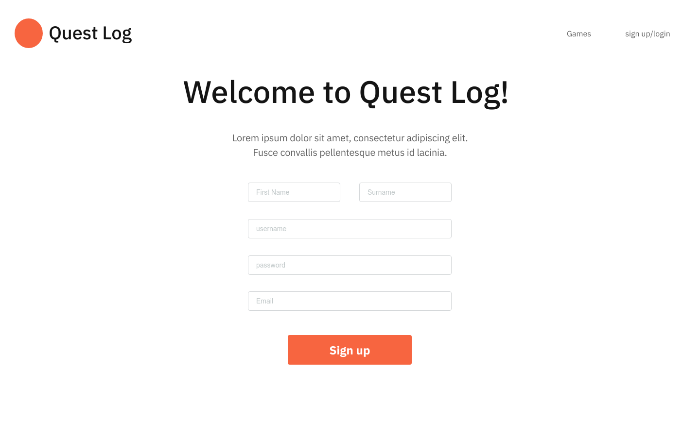
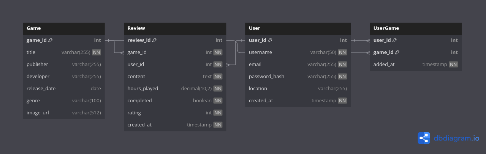

# Milestone Project :three:

[LIVE SITE](https://ms3-questlog-046b16039c76.herokuapp.com/register)

---

## :world_map: Strategy

---

### Project Goals

This is my milestone two project for the [Code Institute's](http://www.codeinstitute.net/) *'Level 5 Diploma in Web Application Development'*. The goal of this project is to *Design, develop and implement a Back end for a web application using Python and a micro-framework.* To this end I am building a webapp utilising Flask & postgreSQL, that will alow users to create, modify, and track reviews for video games. The app will be aimed at gamers, people who are invested in tracking their relationship with videogames and offer a place for users to conveniently archive and keep a track of all the games that they have played and the thoughts that they had on them. Reviews will be abel to be tagged as public or private, and other visitors to the site will be able to browse reviews by game or by user. The site will also aggregate scores of reviews allowing users to accurately assess potential new purchases.  

#### User Goals

- browse the database of reviews 
- a place to keep track of games played
- get more information on unplayed games 

#### Site Operator Goals

- provide a reliable and secure platform for potential monetization through affiliate links 
- provide a good UX to enable growth of the userbase and accuracy of scores and breadth of database

#### Developer Goals

- develop further skill working with postgres and Flask
- develop a site that satisfies goals of the user and site operator and fulfils the project goals 
- create a good UX for users 
- build a performant and efficient site that has room for extensibility

---

## :earth_africa: Scope

---

### User Experience

#### Front End 

The site will be styled using the materialise toolkit to provide a consistent and aesthetic UI. I will use template inheritance using Jinja and Flask in order to create pages that have a consistent and accessible layout with minimal code to ensure a good UX. 

#### Back end 

I will utilise postgreSQL to build the multiple tables within the database that will be necessary 

#### Target Audience

- video game players

#### User Requirements and Expectations

- easy and intiuitive navigation 
- secure login procedures 
- accessible 
- able to browse review by catagory (game, author, aggregate score etc. )
- able to write, delete, edit reviews 

#### User Stories

##### - First Time User

1. As a first time user I want to encounter a landing page that succinclty and clearly explains the functionality of the site 
2. As a first time user I want to be able to browse review of games I am interested in
3. As a first time user I want to be able to sign up to the site in order to login and start posting reviews 
4. As a first time user I want to be able navigate the site easily and intuitively 

##### - Returning User

1. As a returning visitor I want to be able to login quickly and easily
2. As a returning visitor I want to be able to intuitively find all my prior reviews
3. As a returning visitor I want to be able to delete reviews I have previously written
4. As a returning visitor I want to be able to view the profile of others 
5. As a returning visitor I want to be able to write new reviews
6. As a returning visitor I want to be able to edit games to the database if they are not currently there

#### Identified tasks/needs the website should fulfill

| Features                                  |      Importance (1 -5) |
|----------------------------------------------|-------------------|
| site is easy to navigate | 5 |
| site is responsive | 5 |
| browsing the collection of games | 5 |
| browsing all reviews of a given game | 4 |
| user profiles that can be securely logged in to | 3 |
| user profiles allow viewing/manipulation of existing reviews   | 3 |
| allow users to edit games to the database  | 2 |
| profile pages for each user, detailing reviews and some user stats (no. of reviews etc.)    | 3 |
| site is accessible  | 5 |
| site stores user information securely  | 5 |
| site sends useers to a 404 with links to home if game/review/user not found | 4 |
| search existing games   | 5 |

#### Accessibility

---

## :bricks: Structure;

---

### Page Hierarchy 

- base.html

Contains header and footer of site, the rest of the pages will extend from this page. Header to contain login/sign-up links, footer to contain social links, links to tos etc. design credits

- signup.html

sign up form 

- login.html

login page for users with account, 

- user_profile.html

allow users to change account details such as screenname, update password, view number of reviews/games posted, edit/delete posted content.  

- games.html

gallery page for games added to the data base, displayed in a grid with information modals over the top of large images. 

- game.html

information page for a given game, including image, title, publisher/developer information etc. 

- add_game.html

form with details required to add a game to the database, possibly pending admininstrative approval. 

- edit_game.html

edit a game you have added to the database. This functionality will be exclusive to games that users have added to the database not all games. 

- add_review.html

form to attach a review to a given game. 

- edit_review.html

form to edit an existing review

- 404.html

page to send users to if a game/review is somehow not found in the database

---

### Database Structure

The database will contain 4 tables. One for the games, one for reviews, one for users, and a join table that gives me access to all games reviewed for a given user and all reviews from users for a given game.  

 Game Table 
| Column Name | Data Type | Constraints | Key | Nullable |
|-------------|-----------|-------------|-----|----------|
| game_id | int | AUTO_INCREMENT | PK | No |
| title | string(255) | | | No |
| publisher | string(255) | | | Yes |
| developer | string(255) | | | Yes |
| release_date | date | | | Yes |
| genre | string(100) | | | Yes |
| image_url | string(512) | | | Yes |

Review Table 
| Column Name | Data Type | Constraints | Key | Nullable |
|-------------|-----------|-------------|-----|----------|
| review_id | int | AUTO_INCREMENT | PK | No |
| game_id | int | | FK (Game) | No |
| user_id | int | | FK (User) | No |
| content | text | | | No |
| hours_played | float | | | No |
| completed | bool | | | No |
| rating | int | CHECK (rating BETWEEN 1 AND 10) | | No |
| created_at | datetime | CURRENT TIMESTAMP | | No |

 User Table  
| Column Name | Data Type | Constraints | Key | Nullable |
|-------------|-----------|-------------|-----|----------|
| user_id | int | AUTO_INCREMENT | PK | No |
| username | string(50) | UNIQUE | | No |
| email | string(255) | UNIQUE | | No |
| password_hash | string(255) | | | No |
| location | string(255) | | | Yes |
| created_at | datetime | DEFAULT CURRENT_TIMESTAMP | | No |

 user > game / game > users  
| Column Name | Data Type | Constraints | Key | Nullable |
|-------------|-----------|-------------|-----|----------|
| user_id | int | | PK, FK (User) | No |
| game_id | int | | PK, FK (Game) | No |
| added_at | datetime | DEFAULT CURRENT_TIMESTAMP | | No |

I converted the above markup tables into DBML (Database Markup Language) and used [dbdiagram.io](https://dbdiagram.io) to generate a .sql file of my schema to potentially use further into coding my project

 

### Features

- [x] account creation
- [ ] account deletion
- [x] login/logout functionality
- [x] main page displaying all games in database
- [x] search bar querying app api as user types
- [x] if no game is found on searching the db, users are given the option to add a new game
- [x] button to add to My Games on each game not currently in user's My Games collection
- [x] indicator that game is currently in My Games
- [x] cards displaying an image and information on each game and link to each games page
- [x] games in My Games are displayed and can be removed from My Games
- [x] My Review page, aggregating all of a users reviews
- [x] Individual reviews can be edited/deleted from My reviews
- [x] Game Detail page displays game details, aggregate user score, and all reviews of the game
- [x] Game detail page contains contextually appropriate Edit/Add Review buttons
- [x] Games can be deleted from the database from the game detail page
- [x] reviews on Game Detail page display user avatar and link to profile
- [x] User Profiles can be viewed and contain:
        - user stats
        - links to users My Games and My Review pages
- [x] users that are not logged in may browse the game collection but not change any of the present data
- [x] users navigating to their own My Profile page can update password, email and avatar link
- [ ] user statistics

---

## :art: Surface

---

### Design

I will be using the Materialize framework for the structure and styling of this project. This will allow me to more easily focus on the data and functionality of the app while still maintaining an aesthetically pleasing and intuitve to navigate web app.  

#### Typography

#### Colour Palettes

### Technologies and Tools used

#### Languages

- HTML5
- CSS3
- JavaScript
- Python 
- Flask/Jinja
- SQL

#### Tools

- **[Google Chrome](https://www.chrome.com/)**
- **[Firefox](https://www.firefox.com)**
- **[git](https://git-scm.com/)**
- **[lunarVim](https://xxxxxxxxxxxxx.xxx)**
- **[GitHub](https://www.github.com)**
- **[Pencil](https://pencil.evolus.vn/)**
- **[Google Fonts](https://fonts.google.com/)**
- **[Photopea](https://www.photopea.com/)**
- **[amiresponsive](https://ui.dev/amiresponsive)**
- **[postgrSQL](xxxxxxxxxxxxx.xxx)

---

## :microscope: Testing

---

### Testing Procedure

### Functional testing

| test                                           | verified |
| ---------------------------------------------- | -------- |

### User Stories Testing

#### - First Time User Testing

#### - Returning User Testing

#### - Site Owner Testing

### Desktop

### HTML/CSS Validators

### WAVE

### Lighthouse
---

### Mobile Testing

### Bug fixes

1. while writing the profile page, I encountered a bug where the browser would autofill the new password box, I solved this by changing the type of input to text from password and processing it as a password
2. while working on the Add Game functionality, I encountered a bug where the date would only validate if given in a specific format. I solved this by implementing a datepicker that submits to the from in the correct format
3. getting the conditional checks to correctly display contextually relevent buttons 
4. during deployment I ran into an issue in which I was not able to get flask-migrate to function correctly during deployment to heroku, it led to a lot of inexplicable tracebacks and weird build errors. I believe the issue was something to do with the order in which flask-migrate was used, in that it seemed to be trying to access a table that didn't currently exist.  
-------------------------------
--------------------------------
--------------------------------
--------------------------------
--------------------------------

## :loudspeaker: Deployment

---

- clone the repo:
    - > git clone https://github.com/Oxymetaphoric/milestone_project_3

- if you wish to make changes and/or run locally prior to deploying. Some of these steps, especially those related to system packages may vary depending on your operating system: 
    - navigate to the repo:
        > cd path/to/milestone_project_3
    - create a python virtual environment: 
        > python -m venv . 
        > source bin/activate
    - create and populate env.py:
        > touch env.py
        > vim env.py 
        
        import os   
        
        os.environ.setdefault("IP","0.0.0.0")
        os.environ.setdefault("PORT","5000")
        os.environ.setdefault("SECRET_KEY","_your secret key_")
        os.environ.setdefault("DEBUG","True")
        os.environ.setdefault("DEVELOPMENT","True")
        os.environ.setdefault("DB_URL","postgres:///quest_log")

    - install postgresql and create a quest_log database:
        > pacman -S postgresql
        > sudo -u postgres psql
        > CREATE DATABASE [user] quest_log 
    
    - from this point you can run locally with: 
        > python3 app.py 

- navigate to the heroku website and create an account/login. 
- create a new app, and in the Settings page click 'Show Environment Vars', and input: 
    
    |   variable    |     value     |
    |---------------|-----------|
    |IP|0.0.0.0|
    |PORT|5000|
    |SECRET_KEY| _your secret key_ |
    | DATABASE_URL | _your remotely accessible postgres db's url_ |   

- navigate to the Deployment section of Heroku and follow the instructions to deploy via cli or from a github repo. 
- once deployed the db will need to be built, click the More menu button on the project pages header and then Run to open the heroku commandline webtool and enter:
    > python3
    > from quest_log import app, db
    > with app.app_context():
    >    db.create_all()

 it is important to note that the white spaces prior to the 'db.create_all()' command must be typed out or the command will not run due to the python interpreter receiving incorrectly indented instructions

- Once the build process has completed the project should now be accessible online 

---

## :heart: Credits and Acknowledgments

---
favicon from: https://favicon.io/emoji-favicons/alien-monster
My wonderful family!
