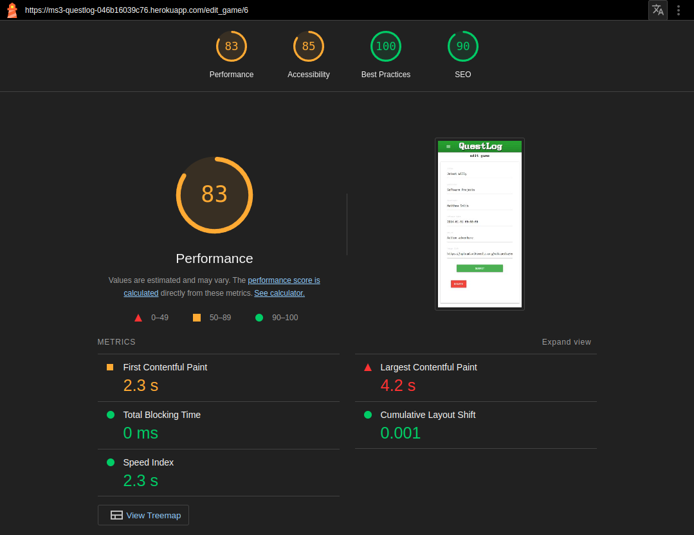

## :microscope: Testing

Manual testing, or user testing, is the process of using the site as intended, clicking buttons, signing up, resizing windows etc. and noting any unintended behaviour or other bugs. 
This process was followed throughtout the development of this process with each new feature thoroughly tested and confirmed to be working before work started on the next feature.

Automated testing is the process fo writing custom scripts to interact with the project by doing things like deleting reviews, creating a new user etc. This methodology was not used during this project, as I judged the time and work involved in automatically testing this site, versus manually testing it during development to not be warrent the investment. 

Further testing was done using HTML, CS, JS, and Python validators as well as using the tools Lighthouse and WAVE to test for performance and accessibility respectively.

---

### Testing Procedure

### Functional Testing

#### Tests while not logged in

| register page testing  | verified |
| -----|---|
| header/menu working | yes|
| sign-up allows new users | yes |
| signup forces unique usernames | yes |

| login |verified|
|-----|---|
| header/menu links working | yes |
| login allows existing users to login | yes |
| login enforces correct password | yes | 
| login disallowed if password missing or incorrect | yes|

| Misc. |verified|
| ----- |---|
| user unable to access profile route without logging in | yes |

#### Test as logged in

| games |verified|
|----|---|
| header/menu working | yes |
| Games page displays entire catalogue | yes | 
| search function triggers on each keystroke | yes |  
| Game cards link to appropriate game page | yes | 
| clicking the plus icon adds game to users My Games | yes | 
| icon displays tick if game is in My Games and reverts to a plus if removed | yes |
| games can be added to and removed from My Games | yes | 
| flash messages display correctly | yes |
| Add Game button shows if searched game not in db | yes |

| Add Game | verified 
| -----|---|
| header/menu working | yes |
| game not added if same as existing title | yes |

| game detail | verified 
| ----|---|
| header/menu working | yes |
| write review button works correctly | yes | 
| write review button only shows if review not written | yes | 
| edit review button shows if review exists from user | yes |
| edit game button works correctly | 
| average score icon works correctly | yes | 

| edit game | verified | 
| ----- | --- |
| header/menu working | yes |
| form is prefilled with correct info | yes | 
| delete game button only displays if user is_admin | yes |
| delete game button displays alert on press | yes | 
| okay button on alert working | yes | 

| My Games | verified |
| ----- | ---- |
| header/menu working | yes |
| title displays conditionally if user owns profile | yes |
| games can be removed from My Games with button | yes |
| game cards link to gaem detail page for correct title | yes |
| flash message displays correctly on adding/removing games from My Games | yes |

| My reviews | verified |
| ------ | ---- |
| header/menu working | yes |
| edit review button works correctly | yes | 
| delete and edit review buttons only displays if user owns profile | yes | 
| delete review button works correctly | yes |
| section title displays conditionally if user owns profile | yes |

| edit review | verified |
| ------ | ---- |
| header/menu working | yes |
| form prefilled correctly | yes | 
| submit button updates db entry | yes |
| users can only review their own reviews | yes |

| Profile | verified |
| ------- | ---- |
| user profile displays edit box only if user owns profile | yes | 
| users cannot edit profiles of others | yes | 
| user accounts can be deleted | yes | 
| user account details can be edited | yes |
| logout functionality works correctly | yes | 
| admin can add users to admin group | yes | 

### User Stories Testing

#### - First Time User Stories Testing

1. I want to encounter a landing page that succinctly and clearly explains the functionality of the site
    
User encounters explanatory text and call to action on loading the page. 

2 .I want to be able to browse review of games I am interested in

first time users can browse the catalogue of games and view the reviews of any games without he need for sign-up, and are presented with the catalogue of games immedietely on page load. 

3. As a first time user I want to be able to sign up to the site in order to login and start posting reviews 

The signup page is clearly signposted in the navigation of the page 

4. As a first time user I want to be able navigate the site easily and intuitively 

The site is simple and intuitive to navigate. Navigation elements are obvious and accessible at all screen sizes. Pages are clearly labelled, and functionality is explained through the use of tooltips and big, chunky UI elements. 

#### - Returning User Stories Testing

1. I want to be able to login quickly and easily

Login details are saved to browser keychain and autofill on returning to the logon screen

2. I want to be able to intuitively find all my prior reviews

My Reviews page aggregates all a users reviews

3. I want to be able to delete reviews I have previously written

Users may delete their own reviews but may not delete or edit the reviews of others 

4. I want to be able to view the profiles of others

users can view the globally acccessible user information of other users, but may not edit or delete other users accounts

5. I want to be able to write new reviews

users can quickly and easily add reviews for games. UI is simple to navigate. 

6. I want to be able to add games to the database if they are not currently there

users must first search for a title, if the title is not found in the database they are presented with the Add Game option. As game titles are unique, the db will have to be queried on any new addition to make sure game_title is unique, as such it makes sense to only present the user with teh option to add a game after they have established it does not already exist in the database. 

### HTML/CSS/JS/Python Validators

#### HTML

Using the W3 HTMl validator for my main page: 

#### CSS

uploading the CSS file to the W3 CSS validator:

### python / javaScript

using codeQL through github gave the following results: 

  

### Lighthouse Testing

#### Desktop

##### Login

##### Register

##### Games

##### Add Game

##### Game Detail

##### Edit Game

##### My Games

##### My Reviews

##### Edit Review

##### Profile

#### Mobile 

##### Login

##### Register

##### Games

##### Add Game

##### Game Detail

##### Edit Game

##### My Games

##### My Reviews

##### Edit Review

##### Profile

